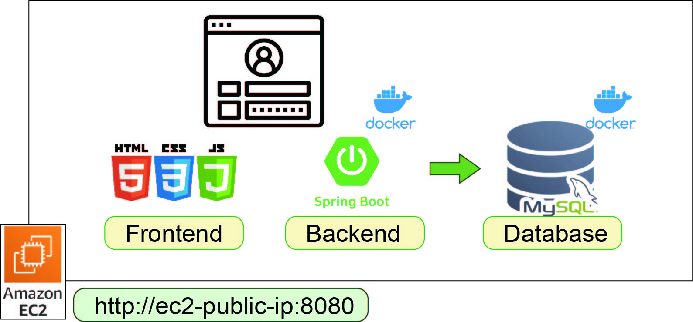

###  Personal-website

---

- Developed a personal website backend using Java and Spring Boot, structured with Spring MVC architecture (Controller, Service, Repository layers) for modular and maintainable code.
- Implemented a message board feature with full CRUD (Create, Read, Update, Delete) functionality, with message data stored in a MySQL database. Both the application and database are containerized and launched using Docker Compose.
- Integrated account management and login verification using Spring Security, featuring authentication, authorization, and CSRF protection to enhance security.
- Code is version-controlled on GitHub and deployed on AWS EC2, using Docker Compose to run the website on the cloud.
- Managed the database using MySQL Workbench for easier data visualization and management.



### Developing with Docker

---

This demo application showcases a simple personal website setup, including the following components:

- **Homepage (index.html)**, **Comment Management Page (commentManagement.html)**, **Message Board Page (comments.html)**, and **Login Page (login.html)**, developed with pure JavaScript and CSS styles, located in the `resources/static/assets` folder.
- **Java backend** with **Spring Boot and Spring MVC architecture**, consisting of the following main components:
    - **config**: Contains `SecurityConfig`, responsible for security configuration.
    - **controller**: Includes `CommentController` and `CsrfController`. `CommentController` handles requests related to comments, including creating, reading, updating, and deleting comments. `CsrfController` manages the CSRF (Cross-Site Request Forgery) protection mechanism, ensuring that all important requests (such as form submissions) carry a valid CSRF Token to prevent forged requests from malicious websites, thereby protecting the application from CSRF attacks.
    - **model**: Contains the `Comment` entity class, representing the comment data structure.
    - **repository**: Contains the `CommentRepository` interface, used for interacting with the MySQL database.
    - **service**: Contains `CommentService`, which handles the business logic related to comments.
    - **application.properties**: Configuration file for the application, providing database connection settings and more.
- **MySQL** is used for data storage, and database operations are visually managed through MySQL Workbench.
- All components run in Docker containers and are managed automatically with Docker Compose, eliminating the need for manual startup of MySQL and the application.

### Development Process Automation Workflow

- **Modify Code**: Make changes and develop code in the local environment to ensure the functionality meets requirements.
- **Run `build.sh`**:
  - Execute the `./build.sh` script in the project root directory. This script will automatically perform the following steps:
    - **Testing**: Run `mvn test` to perform unit tests and verify that the code is correct.
    - **Packaging**: If tests pass, use `mvn package` to package the application and generate a `.jar` file.
    - **Build Docker Image**: Use `docker build` to create a Docker image.
    - **Start Docker Compose**: Launch the application and database Docker containers with `docker-compose up -d`.
- **Manually Git Commit and Push**:
  - **Git Commit**: After verifying the code changes, use the following commands to commit the changes to Git:

      ```bash
      git add .
      git commit -m "Description of changes made"
      
      ```
  
  - **Push to GitHub**: Run the following command to push the local changes to the GitHub remote repository:

      ```bash
      git push origin main
      ```
    
### AWS Deployment

---

Set Up AWS Environment

- **Create an AWS Account**: Make sure you have an AWS account and have configured a payment method.
- **Set Up IAM User**: Go to the AWS Management Console, search for "IAM," and create a user with sufficient permissions (e.g., permissions to manage EC2 and S3).

Create an EC2 Instance

- **Create EC2**: Go to the EC2 Console, select ?Launch Instance,? and choose an appropriate Amazon Linux.
- **Set Instance Size**: Choose `t2.micro` (Free Tier) or another instance type that meets your needs.
- **Configure Security Group**: In the security group settings, allow HTTP (80) and HTTPS (443) ports, as well as the SSH (22) port for remote access.
- **Key Pair**: Create a new SSH key pair, download the `.pem` file for future connections.
- Launch the instance.

Connect to EC2 Locally

- **SSH Connection**: Use the downloaded `.pem` file to connect to the EC2 instance via SSH:

    ```bash
    ssh -i "<.pem file path>" ec2-user@<EC2 address>
    ```

- **Update System**: Perform an update to ensure the system is up-to-date.

    ```bash
    sudo yum update -y  # for Amazon Linux
    ```

- **Install Docker**:

    ```bash
    sudo amazon-linux-extras install docker -y
    sudo service docker start
    sudo systemctl enable docker # enable Docker at startup
    sudo usermod -aG docker ec2-user # add user to Docker grou
    ```

- **Install Docker Compose**:

    ```bash
    sudo curl -L "https://github.com/docker/compose/releases/download/1.29.2/docker-compose-$(uname -s)-$(uname -m)" -o /usr/local/bin/docker-compose # specify Docker Compose version
    sudo chmod +x /usr/local/bin/docker-compose # grant execute permissions
    docker-compose --version
    ```


Deploy the Project to EC2

- **Download Project**: There are two ways to do this:
    - **Clone from GitHub**: On the EC2 instance, run the following commands to clone the project:

        ```bash
        git clone https://github.com/my-username/my-repo.git
        cd my-repo
        ```

    - **Upload Local Files**: If you prefer to upload the project directly, use the `scp` command to transfer files to the EC2 instance. For example:

        ```bash
        scp -i "<.pem file path>" "project file path" ec2-user@<EC2 IP address>:~
        ```


Start the Application

- **Run Docker Compose**: In the project directory, start Docker Compose to run your application:

    ```bash
    docker-compose up -d # run in detached mode
    ```

- **Check Service Status**: Use the following command to check the service status and ensure everything is running properly:

    ```bash
    docker ps
    ```

- To verify that the website is running correctly:

    ```jsx
    http://"public IPv4 address":8080
    ```
  
## Website

---

